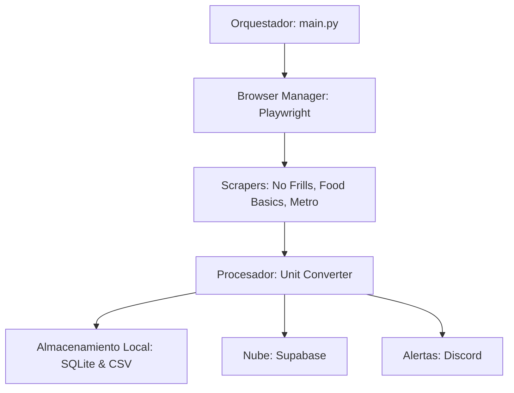

# Documentación del Proceso de Scraping - Capstone Master en Análisis de Datos

Esta documentación detalla la solución de web scraping implementada para el proyecto de seguimiento de precios minoristas, diseñada para cubrir las necesidades operativas y analíticas del restaurante **Familia Fine Foods**.

## 1. Importancia y Contexto

El scraping es la piedra angular de este proyecto por las siguientes razones:

*   **Obtención de Datos Reales del Mercado:** Permite recolectar precios actualizados directamente de los portales de los principales competidores (No Frills, Food Basics, Metro). No depender de APIs externas limitadas asegura la frescura de los datos.
*   **Contraste con Costos de Adquisición:** Almacena precios de mercado para contrastarlos con los precios que el restaurante paga a sus proveedores actuales. Esto permite identificar si los costos internos están alineados con la realidad del mercado.
*   **Análisis de Tendencias y Anomalías:** La recopilación histórica permite detectar variaciones atípicas de precios (inflación, escasez estacional o promociones agresivas) que impactan directamente en el margen del restaurante.
*   **Optimización de Compras:** Facilita la toma de decisiones informadas sobre dónde y cuándo realizar compras de insumos específicos para optimizar el flujo de caja.

## 2. Arquitectura del Sistema

La solución se basa en una arquitectura modular que separa la extracción, el procesamiento y la persistencia de datos.

### Flujo de Datos
1.  **Ejecución:** El orquestador inicia el proceso (vía manual o automatizada).
2.  **Extracción:** Se navega a las URLs de los productos usando **Playwright**, evadiendo detecciones básicas y extrayendo el DOM.
3.  **Procesamiento:** El `UnitConverter` transforma los precios raw (ej. "65¢/100g") en precios estandarizados (ej. "$6.5/kg") para permitir comparaciones directas entre productos de distintas tiendas.
4.  **Persistencia:** Los datos se guardan simultáneamente en una base de datos local para acceso rápido, archivos CSV para análisis offline y en **Supabase** para visualización global.
5.  **Notificación:** Si se detecta un cambio de precio comparado con la última captura, se envía una alerta inmediata a Discord.

## 3. Componentes Técnicos

### 3.1 Orquestación (`main.py`)
Módulo central que gestiona los diferentes modos de operación:
*   `--url`: Permite depurar la extracción de un solo producto.
*   `--ui-mode`: Actualiza un archivo de estado JSON para informar visualmente sobre el progreso.
*   `--import-all`: Importa archivos HTML locales (útil para saltar anti-bots agresivos si fuera necesario).

### 3.2 Scrapers (Playwright)
Cada tienda tiene un scraper especializado (`nofrills.py`, `foodbasics.py`, `metro.py`):
*   Implementan tiempos de espera dinámicos y rotación de agentes de usuario.
*   Extraen tanto el precio de venta como el precio unitario y la disponibilidad de stock.

### 3.3 Estandarización de Unidades (`UnitConverter`)
Crítico para el análisis de datos. Convierte unidades heterogéneas:
*   **Peso:** g, lb, oz -> kg.
*   **Volumen:** ml -> L.
*   **Unidades:** Por pieza/manojo -> Unit.

### 3.4 Almacenamiento y Sincronización
*   **Supabase:** Funciona como el backend principal. Los datos capturados se insertan inmediatamente en tablas SQL para ser consumidos por dashboards de visualización.
*   **SQLite/CSV:** Garantiza que el proceso nunca pierda datos incluso sin conexión a internet y facilita la exportación para el repositorio de datos del capstone.

## 4. Automatización y Monitoreo

Para asegurar que los datos estén siempre vigentes, el proceso se ha automatizado:
*   **launchd (macOS):** Se implementó un archivo `.plist` que ejecuta el scraping de forma programada durante la madrugada.
*   **Notificaciones:** El sistema `alerts/notifier.py` utiliza Webhooks de Discord para informar al equipo cuando hay variaciones de precio en productos críticos.

## 5. Resultados del Proceso
Este sistema ha permitido transformar el proceso de "chequeo de precios manual" en una solución automatizada de **Inteligencia de Precios**, proporcionando una base sólida de datos estructurados para el análisis final del Capstone de Maestría.
